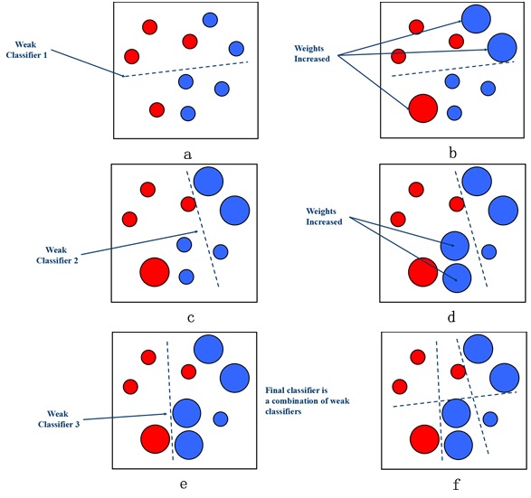

```{r setup, include=FALSE}
knitr::opts_chunk$set(echo = TRUE, warning = FALSE, message = FALSE)
```

## Podstawowe biblioteki
```{r}
library(dplyr)
library(ggplot2)
library(caret) # ML
library(broom) # tidy models
```

## Dane
```{r}
load("../data/nyc_prices.rda") # prices_train
prices_train %>% 
    head()
```

## Bagging


### Lasy losowe

## Boosting 
- tworzymy silny model z wielu słabych modeli,
- algorytm iteracyjny, parametryzowany przez liczbę iteracji,
- w każdym kroku skupiamy się na tych obserwacjach, które poprzednio nienajlepiej dopasowaliśmy.

### Boosting resztowy
- problem: regresja, 
- wyuczamy kolejne modele na resztach powstałych z sumy poprzednich modeli.

Przykład: wielomian IV stopnia.

```{r}
polynomial_function <- function(x) {
    return(poly(x, degree = 4) %*% c(1, 2, -6, 9))
}

grid <- 1:100
polynomial_data <- data.frame(x = grid, y = polynomial_function(grid)) 
polynomial_data$y <- polynomial_data$y + rnorm(length(grid), 1, 0.5) 
polynomial_data %>% 
    ggplot(aes(x, y)) + geom_point()
```
1. Wyucz prosty predyktor.
```{r}
library(rpart)
tree1 <- rpart(y ~., polynomial_data, control = rpart.control(maxdepth = 1))
y1_prediction <- predict(tree1)
cbind.data.frame(polynomial_data, y1_prediction) %>% 
    ggplot(aes(x, y)) + geom_point() + geom_line(aes(y = y1_prediction), color = "blue")
```

2. Policz reszty modelu.
```{r}
errors <- polynomial_data$y - y1_prediction
data.frame(x = polynomial_data$x, errors) %>% 
    ggplot(aes(x, errors)) + geom_point(color = "red")
```
3. Wyucz model na resztach
```{r}
tree2 <- rpart(errors ~., data.frame(x = polynomial_data$x, errors), 
               control = rpart.control(maxdepth = 1))
error2_prediction <- predict(tree2)
data.frame(x = polynomial_data$x, errors, error2_prediction) %>% 
    ggplot(aes(x, errors)) + geom_point(color = "red") + 
    geom_line(aes(y = error2_prediction), color = "blue")
```

4. Dodaj predykcję reszt do predykcji y.
```{r}
y2_prediction <- y1_prediction + error2_prediction
cbind.data.frame(polynomial_data, y2_prediction) %>% 
    ggplot(aes(x, y)) + geom_point() + 
    geom_line(aes(y = y2_prediction), color = "blue")
```

Powtarzaj kroki 2-4.
```{r}
gradient_boosting_step <- function(y, y_pred, x) {
    error <- y - y_pred
    tree <- rpart(error ~., data.frame(x, error), 
               control = rpart.control(maxdepth = 1))
    error_pred <- predict(tree)
    return(y_pred + error_pred)
}

steps <- 3:10
boosting_path <- list()

y_old <- y2_prediction
for (step in steps) {
    y_new <- gradient_boosting_step(polynomial_data$y, 
                                        y_old, 
                                        polynomial_data$x)

    boosting_plot <- (cbind.data.frame(polynomial_data, y_new) %>% 
                        ggplot(aes(x, y)) + geom_point() + 
                        geom_line(aes(y = y_new), color = "blue") + 
                          ggtitle(paste0("Step number ", step)))
    boosting_path[[step]] <- boosting_plot
    
    y_old <- y_new
}

gridExtra::grid.arrange(boosting_path[[3]], boosting_path[[4]], boosting_path[[5]],
                        boosting_path[[6]], boosting_path[[7]], boosting_path[[8]],
                        boosting_path[[9]], boosting_path[[10]], nrow = 2)
```

### AdaBoost (Adaptive boosting)
- problem: klasyfikacja,
- w każdym kroku obserwacje źle sklasyfikowane dostają wyższe wagi w funkcji celu.



- więcej: https://cseweb.ucsd.edu/~yfreund/papers/adaboost.pdf

### XGBoost (Extreme Gradient Boosting)
- przypomina gradient descent,
- zaimplementowany w R w bibliotece `xgboost` i najczęściej używany,
- więcej: 
    - https://arxiv.org/pdf/1603.02754.pdf, 
    - http://xgboost.readthedocs.io/en/latest/model.html
    
To jak to zrobić w R?
```{r}
library(xgboost)
# Funkcja xgboost przyjmuje tylko obiekty typu matrix, dgCMatrix i xgb.DMatrix!
xg_poly_model <- xgboost(data = as.matrix(as.numeric(polynomial_data$x)), 
                         label = polynomial_data$y, 
                         nrounds = 10,
                         params = list(max_depth = 1)) 
xg_prediction <- predict(xg_poly_model, as.matrix(as.numeric(polynomial_data$x)))
cbind.data.frame(polynomial_data, xg_prediction) %>% 
    ggplot(aes(x, y)) + geom_point() + 
    geom_line(aes(y = xg_prediction), color = "blue")
```

Jak wybrać hiperparametry?
- liczba iteracji,
- głębokość drzewa,
- inne
Kroswalidacja!
```{r}
xgb.cv()
```


## Bagging vs. Boosting

## Zadania
1. Wytrenuj las losowy na zbiorze `nyc_prices.rda`.
2. Wytrenuj boosting na zbiorze `nyc_prices.rda`.
3. Który model lepiej sobie poradził? Porównaj błąd średniokwadratowy, stabilność błędów.
