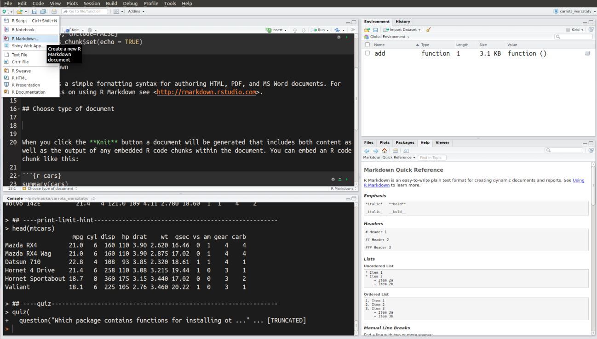
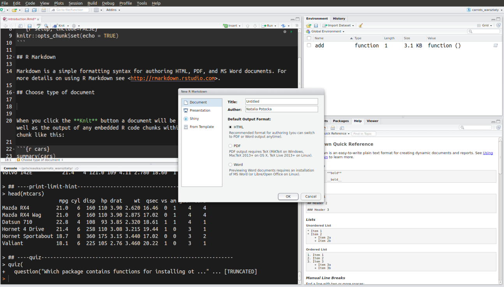
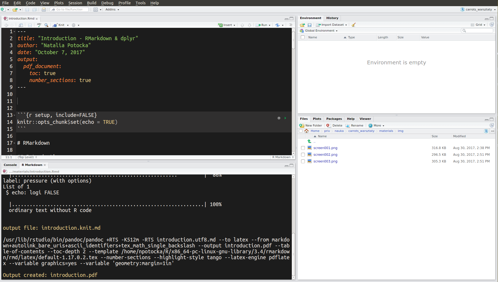
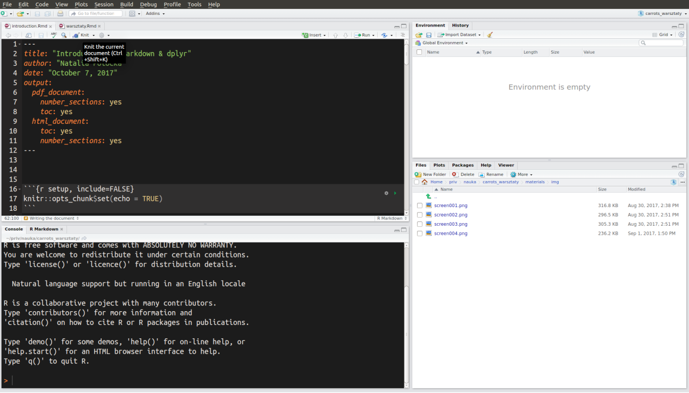

```{r setup, include=FALSE}
knitr::opts_chunk$set(echo = TRUE, fig.width = 3)
```

# RMarkdown

## Introduction

Markdown is a simple formatting syntax for authoring HTML, PDF, and MS Word documents. For more details on using R Markdown see <http://rmarkdown.rstudio.com>.

## Create new document

To start a new document go to File → New file→ RMarkdown or choose  RMarkdown from the list as in the screen below.



You may choose the type of document that you want to create. You can pick from several categories:

* Documents
    - HTML
    - PRD
    - Word
* Presentations
    - HTML (two formats)
    - PDF
* Shiny
    - Document
    - Presentation
* From template

The type of document to render can be changed later. The whole list of available document formats is availaible here: http://rmarkdown.rstudio.com/formats.html




## YAML

At the beginning of each document there is a specification of your document indicating the title, author, date and **output**. The output part defines how your document is generated. You can specify there the type of document to render, table of contents, theme of your document, type of code highlights and any other parameters specified for the type of document that you are using. All of the parameters that may be set for the document are specified here: http://rmarkdown.rstudio.com/formats.html




## Rendering the document

To be able to render the document you need the following packages installed: **rmarkdown** and **knitr**. For a special type of document you will need some other software, for example to be able to render pdf document you need LaTeX and for shiny documents you need shiny package.

To render the document press: **CTRL/CMD + SHIFT + K** or click **Knit** at the top of the document.




## Writing the document

### Headers

```
# Header 1

## Hedaer 2

### Header 3
```


### Emphasis

```
Alice has a *cat* _cat_
Tola has a **tablet** __tablet__
```

### Lists


```
Unordered list:

* item 1
* item 2

- another item
- and another one (4 spaces to have a sublist)
    * sublist 1a
    * sublist 1b
        + subsublist 1b1
        + subsublist 1b2
```

```
Ordered list:

1. item 1
5. item 2
3. item 3
    1. item 3.1
    1. item 3.2  


   
1. item
2. item

```

### Line breaks

```
I want a new line (two spaces and enter)  
new line
```

### Links

```
Link www.facebook.com  
Another link <http://www.example.com>  
[this is what you'll see int the text](www.facebook.com)
```


### Images

```


```


### Tabels

```
Header 1   | Header 2
---------- | -----------

Value 1    | Value 2  
Value 3    | Value 4  
```

## Code chunks

```
 ```
 Text in code style
 ```
```

```
 ```c
 int add(int a, int b){
   return(a+b)
 ```
```

** R code **

### Code:

```{r, echo = FALSE, comment = NA}
cat(c("```{r}", "1 + 2", "```"), sep = "\n")
```

Output:

```{r, echo = FALSE}
1 + 2
```

### No evaluation:

```{r, echo = FALSE, comment = NA}
cat(c("```{r, eval = FALSE}", "1 + 3", "```"), sep = "\n")
```

### No code:

```{r, echo = FALSE, comment = NA}
cat(c("```{r, echo = FALSE}", "1 + 5", "```"), sep = "\n")
```

Output:

```{r, echo=FALSE}
1 + 5
```

### Results hidden: 

```{r, echo = FALSE, comment = NA}
cat(c("```{r, results = 'hide}", "x <- 1:5", "x <- sum(x)", "x", "```"), sep = "\n")
```

```{r, echo = FALSE, results = 'hide'}
x <- sum(1:5)
```

### Results as they are - tables:

```{r, echo = FALSE, comment = NA}
cat(c("```{r, results = 'asis}", "iris[1:3, 1:4]", "knitr::kable(iris[1:3, 1:4])", "```"), sep = "\n")
```

Output:

```{r, results='asis'}
iris[1:3, 1:4]
knitr::kable(iris[1:3, 1:4])
```

### Disabling messages:

```{r, echo = FALSE, comment = NA}
cat(c("```{r, message = FALSE, warning = FALSE, error = FALSE}", "library(dplyr)", "```"), sep = "\n")
```

### Caching

Caching is remembering the results that you've created earlier so they are not computed again

```{r, echo = FALSE, comment = NA}
cat(c("```{r, cache = TRUE}", "plot(1:100000, rnorm(100000))", "```"), sep = "\n")
```

```{r, cache = TRUE, echo = FALSE}
plot(1:100000, rnorm(100000))
```

### Global chunk options

It is recommended to set global options, for example if you are planning to hide all your code and present just the output set `echo = FALSE` option globally:

```{r, echo = FALSE, comment = NA}
cat(c("```{r, echo=FALSE}", "knitr::opts_chunk$set(echo=FALSE, fig.width = 8)", "```"), sep = "\n")
```

If you want to show the code in one of the chunks you can change it locally:

```{r, echo = FALSE, comment = NA}
cat(c("```{r, echo=TRUE}", "# some code", "```"), sep = "\n")
```

### Inline code

To put some code inline try: 
```{r, echo = FALSE, comment = NA}
cat(c("`some code`"), sep = "\n")
```
for code styling or
```{r, echo = FALSE, comment = NA}
cat(c("`r x+7`"), sep = "\n")
```
for R code evaluation.


